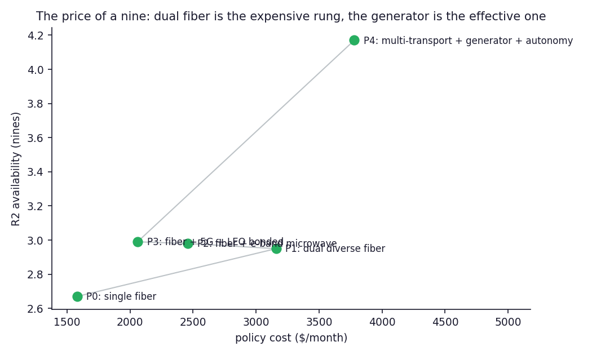

# AI-RAN ↔ Neocloud Resiliency: the last mile, priced in nines

**When an operator hosts tenant AI at a radio site and calls it carrier-grade, what does the last mile actually deliver — and which investment buys the next nine?** This repository answers with a Monte Carlo fault-injection model of the converged AI-RAN/edge-neocloud site: calibrated fiber cuts, microwave rain fades, LEO flaps on Starlink's measured 15-second cadence, grid outages, storms that correlate all of them, and GNSS jamming against holdover clocks — run against a five-rung resilience policy ladder, P0 (single fiber) to P4 (multi-transport bonding + generator + rubidium + local autonomy).

**TL;DR:** run `airan-resiliency ladder` and the ordering the industry's pitch implies comes out backwards. **(1) A single-fiber edge site is a ~2.7-nines site** (~19 h/yr down) — "carrier-grade edge AI" on that footing is marketing. **(2) Multi-transport bonding is the cheapest rung ($480/mo) and it works — but only for tenant traffic**: the fronthaul/timing class R0 cannot ride 5G or LEO, so the class that justifies the site gains nothing. **(3) You cannot bond your way out of a power outage**: all transport diversity combined buys ~0.3 nines; the generator rung buys ~1.2 — buy the generator (and the $60/mo rubidium clock) before the third link. **(4) E-band microwave beats a second fiber** at $700/mo less, because "diverse" fiber pays the shared-duct SRLG tax while rain only degrades a properly engineered link.

*Part of the DIMAGGI series on turning GPU capital into usable compute — the recovery factor of `usable = nominal × network × scheduling × recovery × placement`, taken to the network edge. Full analysis in [docs/study.md](docs/study.md) (including the Deliverable-1 convergence blueprint: split planes, R0/R1/R2 classes, DPU-enforced zero trust, and what control-plane machinery is actually mature); all calibrations trace to [REFERENCES.md](REFERENCES.md). Companion repo: [edge-continuum-placement](https://github.com/dimaggi-ai/edge-continuum-placement) — where workloads belong on the continuum this repo keeps alive.*

---

## What each rung buys


Transport rungs (P1–P3) move R1/R2 from 2.7 to ~3.0 nines and stall — and P3's R0 equals P0's, because bonded 5G/LEO paths cannot carry a ~100 µs fronthaul budget. The jump to ~4.2 nines across every class is the generator rung.

## Where the hours live


Decomposed by cause: bonding (P3) eliminates the connectivity share of tenant downtime entirely — what remains is *pure power*, plus the GNSS tail for R0 that only a better holdover clock (rubidium: 36 h inside ±1.5 µs, vs ~6 h for OCXO) removes. This is the FCC's disaster record — more than half of cell-site outages in major events are power failures — reproduced in simulation.

## The price of a nine



P0→P4 is ~1.5 additional nines of tenant availability for $2,200/month. The steepest value rung is the cheapest one (bonding); the decisive one is the generator; the worst $/nine on the board is the second fiber.

## Quickstart

```
pip install airan-neocloud-resiliency        # or: pip install -e .
airan-resiliency ladder                       # P0->P4, availability + cost
airan-resiliency policy -p P3                 # one policy: ETTR, retention
airan-resiliency transports                   # the calibrated failure catalog
```

Every rate, repair time, battery-hour, and dollar is a dataclass field — recalibrate to your region and rerun:

```python
from resiliency.policies import P2
from resiliency.sim import StormConfig, simulate

hurricane_coast = StormConfig(rate_per_year=2.5, mean_duration_h=36.0)
simulate(P2, years=2000, storm=hurricane_coast).classes["R2"].nines
```

## Reproduce

```
make test        # 19 invariant tests: eligibility, monotonicity, findings
make figures     # regenerates figures/ (needs matplotlib)
```

Python 3.10+, stdlib only; `matplotlib` only for figures. The findings the study reports are asserted as test invariants — they must *fall out* of the simulation, not be asserted by it.

## Series — turning GPU capital into usable compute

- **GPU Cluster Networking** ([network-vs-more-gpus](https://github.com/dimaggi-ai/network-vs-more-gpus)) · **GPU Cluster Scheduling** ([scheduler-vs-more-gpus](https://github.com/dimaggi-ai/scheduler-vs-more-gpus))
- **Compute↔Power Placement** ([compute-power-placement](https://github.com/dimaggi-ai/compute-power-placement)) · **Edge↔Neocloud Placement** ([edge-continuum-placement](https://github.com/dimaggi-ai/edge-continuum-placement)) — the companion: where workloads belong
- **Chaos Fidelity Standard** ([ai-cluster-chaos-fidelity](https://github.com/dimaggi-ai/ai-cluster-chaos-fidelity)) · **Reliability Economics** ([reliability-economics](https://github.com/dimaggi-ai/reliability-economics)) · **Governed Autonomy** ([governed-autonomy](https://github.com/dimaggi-ai/governed-autonomy))
- **AI-RAN ↔ Neocloud Resiliency** (this work) — the last mile, priced in nines

---

*Margaret (Maggie) Nanyonga — Founder & Principal Architect, [DIMAGGI AI](https://dimaggi.ai). Governed AI infrastructure: the control, reliability, and audit layer for autonomous systems operating production networks and compute.*
