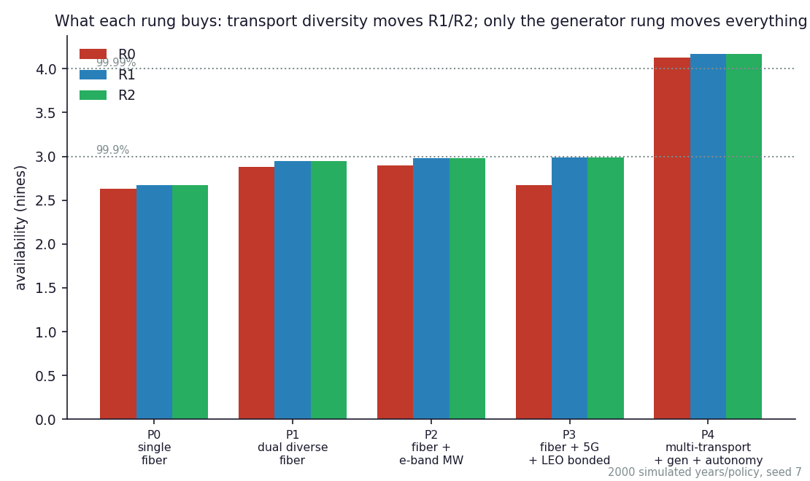
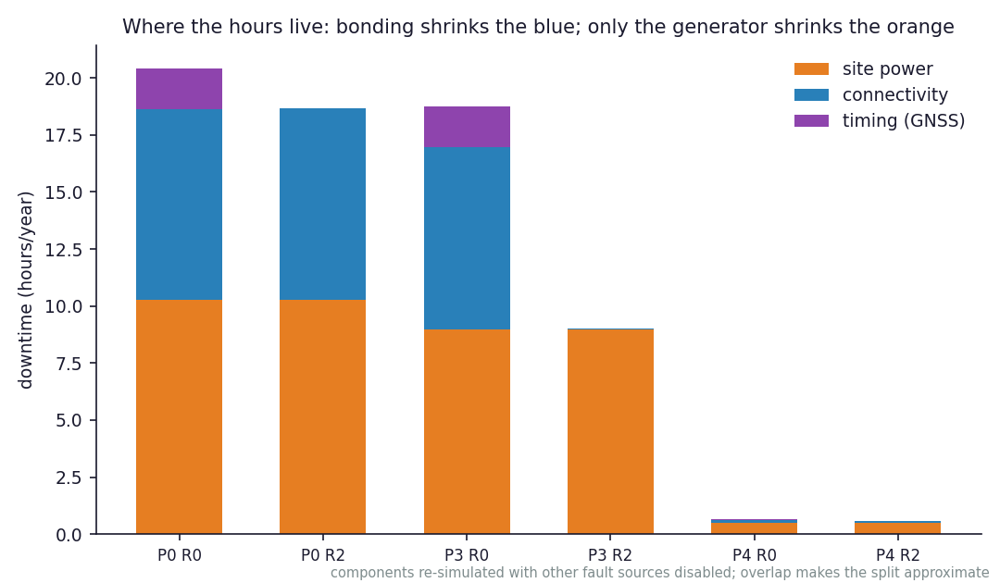

# Carrier-grade resiliency for the AI-RAN last mile: a blueprint and its price

Reference numbers point to [REFERENCES.md](../REFERENCES.md). The
headline table reproduces with
`python3 -m resiliency.cli ladder --years 20000` (seed 7); the CLI
default of 2,000 years gives the same numbers to within Monte Carlo
noise (see the skeptic section for the seed spread); figures with
`python3 run.py`.

## The question

The AI-RAN pitch asks operators to host paying tenants' AI workloads at
radio sites; the neocloud pitch asks them to trust GPU capacity across a
WAN. Both borrow the word *carrier-grade*. This study takes the word
seriously twice over: first as an **architecture** (Deliverable 1 — what
a converged AI-RAN/neocloud site must look like to be multi-tenant and
survivable at all), then as a **number** (Deliverable 4 — what
availability the last mile actually delivers, per resilience class, per
dollar, under correlated failures).

The companion repo,
[edge-continuum-placement](https://github.com/dimaggi-ai/edge-continuum-placement),
established *where* workloads belong on the tower→hub→metro→central
continuum and why the aggregation hub wins the edge. This repo assumes
that answer and asks: **when the backhoe, the storm, the grid, and the
jammer arrive, what does the hub still deliver, and which investment
buys the next nine?**

## Deliverable 1 — the convergence blueprint

Five design rules make an AI-RAN site and a neocloud tenant coexist.
None of them are aspirational; each is anchored to shipping practice.

**1. Split the planes; the demark is IP.** Inside the site: lossless
RDMA fabrics, MIG-partitioned GPUs, PTP timing. Across the carrier
network: SRv6 + BGP-EVPN transport [16]. The tenant demark is an EVPN
Type-5 route into a per-tenant VRF/VXLAN, terminated on a DPU — exactly
what CoreWeave ships on BlueField-3 today [17]. RDMA never crosses the
demark; the physics repo prices why.

**2. Classes, not applications, get resilience promises.** Every flow is
R0 (hard-real-time radio: fronthaul, DU, PTP), R1 (control: near-RT RIC,
orchestration), or R2 (tenant AI). The class decides transport
eligibility: R0 rides fiber or engineered E-band only — a ~100 µs
one-way fronthaul budget and a ±1.5 µs phase budget [15] cannot ride a
50 ms satellite path. R1/R2 may ride anything, bonded. This is the
single most consequential line in the model, because it means **the most
critical traffic class is the one multi-transport bonding cannot help.**

**3. The RAN floor is pinned and non-preemptible.** Aerial's validated
co-residency runs the RAN on a fixed MIG slice with tenant inference
alongside [19]; MIG's isolation is a hardware path partition, and
reconfiguration requires idle instances. Tenant AI never preempts R0
compute, and the blueprint treats the RAN slice as part of the site's
power floor, not its schedulable capacity.

**4. Zero trust is enforced below the host.** The DPU is the policy
enforcement point — the host sees a NIC, management runs out-of-band via
the DPU BMC [17]. A compromised tenant, or a compromised host OS, cannot
reach the policy domain. O-RAN WG11's zero-trust posture (attacker
assumed present; MACsec optional on fronthaul planes [15]) extends the
same stance to the radio side.

**5. Claim only mature control-plane machinery.** SRv6 µSID and
EVPN-over-SRv6 are multi-vendor interop-tested [16]; TI-LFA sub-50 ms
repair is a design target vendors document, not an interop-measured
guarantee; BGP CAR/CT — the intent-aware inter-domain routing the
marketing loves — became RFCs in 2025 as *Experimental* [16]; DetNet
scopes itself out of the open internet [16]. And the neocloud side's
public promises are thinner than the language suggests: CoreWeave's only
numeric public SLA is 99.9% on object storage; GPU rack-level ~99%
guarantees are negotiated terms [18]. A blueprint that assumes
five-nines transport intent-routed across domains is fiction; one that
assumes EVPN + TI-LFA + measured last-mile diversity is buildable now.

## The failure model

The simulator (`resiliency/sim.py`) injects, per simulated year:

- **Fiber cuts** at planning rates (13/1,000 route-mi-yr metro, ~10 km
  route) with 8 h repairs, plus upstream/equipment events calibrated so
  a single-homed access lands at its ~99.9% SLA floor [1, 2] — the
  standalone circuit simulates at 99.91% (7.8 h/yr).
- **Microwave rain fades** that *degrade* rather than drop (adaptive
  modulation [3]; the 40/yr event rate is a planning assumption),
  tripled in storms; rare hardware failures. A fade counts as *down*
  for fronthaul-grade R0 — 25% of an E-band link is not a fronthaul —
  and as a capacity-share loss for tenant R2.
- **LEO flaps**: ~200/yr short interruptions — an aggregation of the
  measured ~15,000 mostly-sub-2-second events/yr aligned to the 15-s
  reconfiguration cadence, preserving approximate annual downtime
  [5, 6] — plus rare longer outages. Bonded policies absorb flaps by
  packet duplication — which is what shipping bonders do [8].
- **Grid outages**: EIA routine baseline plus storm-driven multi-hour
  events [12]; batteries bridge 4–8 h; generators (when bought) run
  96 h per tank [10, 11] with an assumed 6% per-event start-failure
  probability (an industry rule of thumb, not a sourced statistic).
- **Storms** as the correlation engine: grid down with p=0.7, fiber
  repair crews saturated (MTTR ×3), rain-fade rate ×3, the neighboring
  macro carrying 5G FWA dark after its own 4 h battery [10]. This is
  the model's spine — the FCC's disaster record says power, not
  transport, is the dominant cause [10], and the storm process is
  calibrated to reflect it.
- **GNSS loss**: 0.5 events/yr × 8 h mean (a planning assumption;
  jamming grew 67% last year [13]); OCXO holds the ±1.5 µs budget
  ~6 h, rubidium ~36 h.
- **SRLG on "diverse" fiber**: 15% of physical *cuts* (and only cuts —
  upstream equipment events stay independent) hit both paths anyway:
  shared duct, same bridge crossing, same backhoe. The fraction is a
  planning assumption; audit your own duct maps.

## Deliverable 4 — what the ladder buys (20,000 simulated years)

| policy | $/mo | R0 | R1 | R2 | R2 retention | binding constraint |
|---|---|---|---|---|---|---|
| P0 single fiber, 4 h battery | 1,660 | 99.779% | 99.800% | 99.800% | 99.80% | everything |
| P1 dual diverse fiber | 3,160 | 99.871% | 99.892% | 99.892% | 99.80% | power + SRLG |
| P2 fiber + E-band | 2,460 | 99.874% | 99.895% | 99.895% | 99.79% | power |
| P3 fiber + 5G + LEO | 2,060 | 99.786% | 99.897% | 99.897% | 99.81% | power |
| P4 all + generator + Rb + autonomy | 3,780 | 99.993% | 99.994% | 99.994% | 99.88% | long-tail storms |

The ladder isolates one investment per rung: battery is held at 4 h
and the clock at OCXO until P4, so each row's delta is attributable to
the thing it names. *R2 retention* is usable capacity, not uptime — it
additionally charges degraded-autonomy hours and partial-capacity hours
(a rain fade, one lost link of a bond) by capacity share.

Seven findings, the load-bearing ones invariants in
`tests/test_invariants.py`:

**1. The single-fiber edge site is a ~2.7-nines site.** Seventeen and a
half hours a year of R2 downtime (19 for R0) — roughly half transport,
half power. Any "carrier-grade edge AI" claim built on P0 is marketing.

**2. Bonding is the cheapest rung and it works — for R1/R2 only.** P3
adds 5G + LEO for $400/month and takes R1/R2 connectivity losses to
almost zero (the downtime-split figure shows P3's R2 bar is essentially
*pure power*) — matching the $1,500 second fiber's availability. But
P3's R0 equals P0's R0 to within noise: **the fronthaul cannot ride the
bonded paths**, so the class that justifies the site gains nothing.
Bonding is a tenant-continuity tool, not a radio-continuity tool.

**3. You cannot bond your way out of a power outage.** All transport
diversity combined (P0→P3) buys ~0.3 nines of R2; the generator rung
buys ~1.2 more. Every transport rung — P1, P2, P3, at $1,500, $800,
and $400 — converges on the same ~99.89–99.90% wall, because after the
links are diverse the site's availability *is* its power chain. That is
consistent with the FCC's disaster finding [10], which the storm
process was calibrated to reflect. The order of investment the
industry's own pitch implies — more links first — is backwards; the
generator comes first.

**4. Microwave matches a second fiber, at $700/month less.** P2 and P1
land within simulation noise of each other on every class — so the
choice is decided by price and failure independence, and both favor
E-band: the diverse fiber pays the SRLG tax (a planning-assumption 15%
of physical cuts hit the "diverse" path's shared duct or bridge
crossing), while E-band fails in a genuinely independent mode (rain,
which mostly degrades, not drops [3]). Where trenching is expensive,
this ordering is decisive — and microwave already carries a large share
of the world's backhaul [4].

**5. Timing is R0's hidden tail, and rubidium closes it.** With OCXO
holdover, GNSS events beyond ~6 h put R0 down even when every link and
generator holds — visible as the purple slice in the split figure. The
rubidium rung (~$60/month) holds phase for 36 h and erases the tail.
Given jamming's growth curve [13], this is the cheapest nine on the
board.

**6. Local autonomy is insurance against the correlations the model
cannot enumerate.** Under P4's four transports, full WAN partitions are
so rare that degraded local serving adds little *measured*
availability. Its value is the tail beyond the model: regional events
that take every bonded path at once. The blueprint keeps it because its
cost is small and its failure mode ("site keeps serving cached models
at 60% capacity") is the difference between an outage and an incident —
but the honest accounting is that it is the last rung, not the first.

**7. Availability is not usable capacity.** No transport rung moves R2
retention off ~99.8%: bonding keeps the site *reachable*, but the
0.45 Gbps of 5G + LEO is ~4% of the fiber's capacity, rain fades shave
the E-band bond, and every hard failure of one link costs its capacity
share even while the class stays "up". Even P4 reaches only ~99.88%
retention against 99.994% availability. A tenant SLA written in
availability nines and a capacity promise written in Gbps are different
products — the neocloud series' `usable = nominal × …` discipline,
applied to the last mile.

**The playbook, in one sentence:** classify flows (R0/R1/R2), bond the
last mile for the tenant classes, buy the generator and the rubidium
clock before the third transport, and reserve local autonomy for the
tail — priced here at $2,120/month for ~1.5 additional nines.

## What a skeptic should attack

- **Calibration vintage.** Fiber-cut rates are 1990s–2000s planning
  numbers [1]; grid statistics are US-average [12]; storm rate 0.8/yr
  is a temperate-coast stand-in. Every rate is a constructor argument —
  rerun with your region's numbers. The *ordering* of findings 2–5 is
  robust across the ranges we tried; the absolute nines are not.
- **Exponential durations.** Real outage tails are heavier (Starlink's
  are measured heavy-tailed [6]; grid major events dominate hours
  [12]). Heavier tails would *strengthen* findings 3 and 6 (power and
  autonomy matter more), weaken none.
- **The storm model is one correlation.** Real disasters correlate more
  things (LEO ground-station power, cellular core congestion, fuel
  logistics for refueling — the model's generator gets one tank, no
  refuel). All omissions flatter the *transport* rungs, not the
  generator rung, so finding 3 survives its own critique.
- **Flap absorption is assumed, not simulated.** When another bonded
  path is up, P3/P4 treat LEO flaps as absorbed (WAN
  smoothing/duplication [8] — what shipping bonders do). Standalone
  LEO simulates at ~99.90% (8.5 h/yr, dominated by the flap
  aggregate). If your bonder does failover rather than duplication,
  add seconds-scale hits per flap.
- **Monte Carlo precision.** The headline table is one 20,000-year run
  (seed 7). Across ten seeds at 2,000 years, P4's R2 downtime spans
  0.49–0.70 h/yr — a ±0.001-percentage-point spread on availability —
  which is why P4 is quoted as ~99.994% and the last digit should not
  be read as significant. P0's spread is ±0.7 h/yr on ~17.5.
- **Costs are planning-grade** [20]. They set the ordering of the cost
  axis; procurement will move the numbers, and P1 vs P2 ($3,160 vs
  $2,460) is the comparison most sensitive to local trenching reality.
- **The 60% degraded-retention figure** for local autonomy is a design
  target (cached models, local RAG index), not a measurement. Finding
  7's retention numbers charge degraded hours at this figure; nothing
  else depends on it.

Findings 1–5 are re-run across eight seeds independent of this study's
in [`validation.py`](../validation.py), at the same 2,000-year horizon
used above, and each is stated so that it *could* fail: "within noise"
is measured against the model's own reseeding spread rather than a
chosen threshold, and the generator's value is an ordering rather than
a margin. Two claims did not survive that treatment and were replaced —
an earlier "≥1.0 nines" generator threshold, picked after seeing 1.15,
and a rung-tie stated as a maximum rather than a mean; both held at the
shipped seeds and failed on reseeding. The registry also prints what it
does **not** check — the storm magnitude, the 6% generator
start-failure rate, the 15% SRLG fraction, P4's absolute availability,
and this 60% figure — and `tests/test_validation.py` breaks the
simulator six ways to confirm the registry goes red when the model does.

## What this study does not claim

It does not claim the last mile can reach hyperscaler-region
availability — P4's ~4 nines against storm tails is the honest ceiling
for a single site, and anything beyond it comes from *fleet-level*
redundancy (N+1 hubs per metro), not from gold-plating one site. It
does not claim LEO is a fronthaul or RDMA transport — eligibility rules
forbid exactly that. And it does not model the radio access network
itself (spectrum, interference, RF planning): "R0 up" means the site
can run its DU with timing and fronthaul intact, which is the
infrastructure floor the radio needs, not the radio's own performance.
